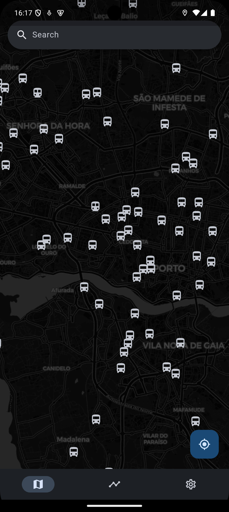
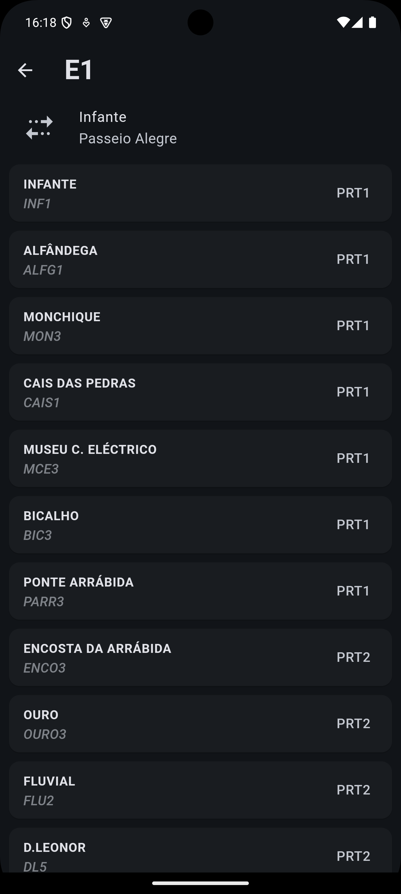
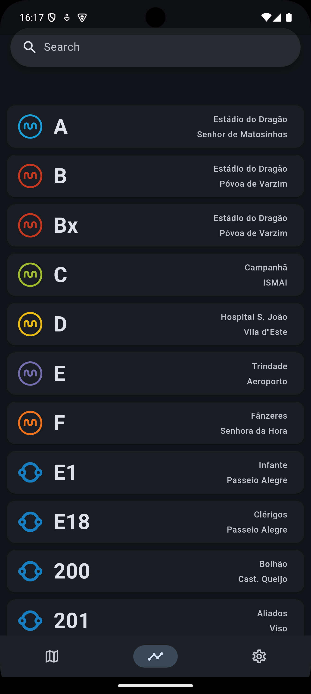
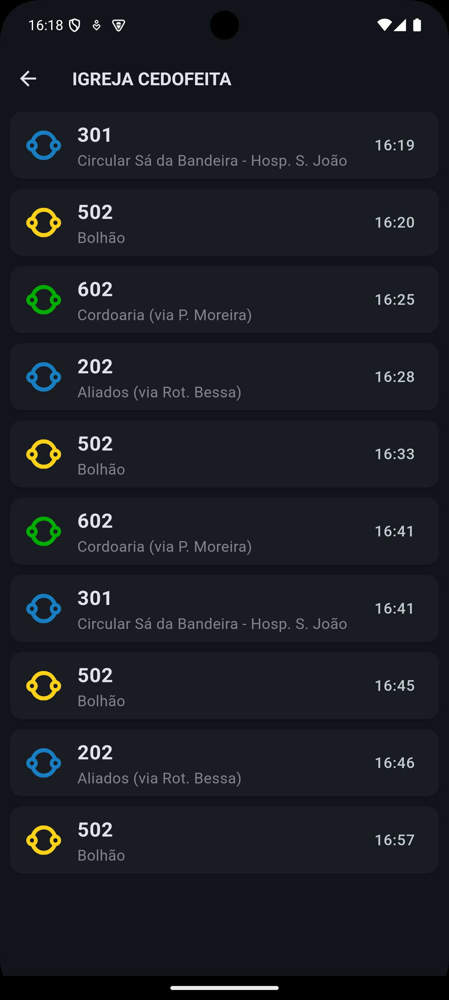

# UnTrap

### Description
This mobile app was built to assist Porto's public transportation users.

The user can access the Metro and STCP timetables through menus or a map.

This project was based on [Maze](https://github.com/apilifogladif/ES2324_Project).

### How to run

1. Download the `.apk` file from [latest release](https://github.com/progr-amador/UnTrap/releases/tag/v1.0) on your phone
2. Run the file and proceed with the install instructions

### Screenshots
|          Map           |           Line           |            Routes           |           Stop           |
|:----------------------:|:------------------------:|:---------------------------:|:------------------------:|
|  |  |   |  |
